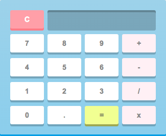

# DevMtn-React-Introduction


## Setup
For this setup we will be using create-react-app to quickly create our base for our react calculator project. To get started `npm install` or `yarn install` when in the root directory of the project. Be sure to also `sudo npm install -g create-react-app` to gain access to its CLI. Once everything is installed we're ready to create the project.

In your terminal type in `create-react-app app` when in the root directory of the project. This process may take up to 5 minutes depending on your internet speed.

---
## Step 1
### Summary
After create-react-app has finished, you'll notice we now have a folder named app in the root of our project. That's because we used the command `create-react-app app` if we wanted our folder to be named something different we could use `create-react-app myAwesomeProject`.

Change your directory, using your terminal, to inside of the app folder ( `cd app` ) so we can have access to the pre-defined scripts that create-react-app made for us in the package.json. If we run `npm start` you should see your default browser pop-up and see the react landing page.


If a browser didn't pop up for you, double check that your terminal is in the app folder.

In this step we are going to change the default react landing page to our calculator.

### Detailed Instructions
If we look in our App.js we will see create-react-app created our first component for us. Normally we would start editing this file but we are going to over-write it to save time ( app -> public -> src -> App.js ). Erase everything and use the following code for App.js:
<details>
<summary> App.js </summary>
````jsx
import React, { Component } from 'react';
import './App.css';

class App extends Component {
	render() {
		return (
			<div id='App'>
				<div id="container-main">
					
					<div id="calculator-mask" className="remove-highlight">

						<div className="output">
							<span className="total"></span>
						</div>

						<div className="btn clear"></div>

						<div className="btn zero"></div>
						<div className="btn one"></div>
						<div className="btn two"></div>
						<div className="btn three"></div>
						<div className="btn four"></div>
						<div className="btn five"></div>
						<div className="btn six"></div>
						<div className="btn seven"></div>
						<div className="btn eight"></div>
						<div className="btn nine"></div>

						<div className="btn equal"></div>
						<div className="btn multiply"></div>
						<div className="btn divide"></div>
						<div className="btn subtract"></div>
						<div className="btn add"></div>
					</div>
				</div>
			</div>
		);
	}
}

export default App;
````
</details>

In addition to App.js we are going to over-write index.css ( app -> src -> index.css ) with the following code:
<details>
<summary> index.css </summary>
````css
body {
	margin: 0;
	padding: 0;
	font-family: sans-serif;
	display: flex;
	justify-content: center;
	align-items: center;
	width: 100%;
	height: 100vh;
}

.remove-highlight {
	user-select: none;
}

#container-main {
	height: 267px;
}

#calculator-mask {
	width: 325px;
	height: 267px;
	position: relative;
	top: -272px;
}

.btn {
	width: 66px;
	height: 40px;
	display: inline-block;
	position: absolute;
	cursor: pointer;
}

.output {
	position: absolute;
	width: 212px;
	height: 40px;
	top: 21px;
	left: 93px;
}

.total {
	position: absolute;
	right: 7px;
	bottom: 3px;
	font-size: 27px;
	color: burlywood;
}

.clear {
	left: 20px;
	bottom: 206px;
}

.zero {
	bottom: 18px;
	left: 20px;
}

.one {
	bottom: 65px;
	left: 20px;
}

.two {
	bottom: 65px;
	left: 93px;
}

.three {
	bottom: 65px;
	left: 166px;
}

.four {
	bottom: 112px;
	left: 20px;
}

.five {
	bottom: 112px;
	left: 93px;
}

.six {
	bottom: 112px;
	left: 166px;
}

.seven {
	bottom: 159px;
	left: 20px;
}

.eight {
	bottom: 159px;
	left: 93px;
}

.nine {
	bottom: 159px;
	left: 166px;
}

.equal {
	bottom: 18px;
	left: 166px;
}

.multiply {
	bottom: 18px;
	left: 239px;
}

.divide {
	bottom: 65px;
	left: 239px;
}

.subtract {
	bottom: 112px;
	left: 239px;
}

.add {
	bottom: 159px;
	left: 239px;
}
````
</details>

#### Solution
If everything worked correctly your browser should look like this:


---
## Step 2
### Summary
In this step we are going to assign variables to state which we will need to keep track of information during run time. State is an object that can determine how components function. On the state object you can put however many properties you need and the entire component has access to them. You are also not limited to what you can assign the properties. You can use variables, integers, strings, objects, functions, etc...

For example if you had:
````jsx
this.state = {
	header: 'My Awesome Header'
}

<span id="header"> {this.state.header} </span>
````
On render the span with the id of header is going to use whatever was assigned to `this.state.header`. In this instance, header will render with the text of "My Awesome Header". This also makes our header element dynamic. When ever `this.state.header` updates the span tag will update with it.

For example: If we had a button click function that changed `this.state.header` to "Other Header", the span tag on the DOM will then render in with the new value of "Other Header."

### Detailed Instructions
Just above the render function in App.js let's add a function called constructor. Before we can do anything with state we are required to call `super()` inside of the constructor function. After calling `super()` we can use `this.state = {}` to start setting properties on state. For this calculator to work we are going to need a couple variables and also some functions. For now let's focus on the variables.

Let's define in our state: `display: '0'`, `operator: ''`, `temp: 0`, and `resetDisplay: false`. Notice how display is a string and temp is an integer.
#### Solution
<details>
<summary> Constructor Fn </summary>
````jsx
constructor(props) {
	super();
	this.state = {
		display: '0',
		operator: '',
		temp: 0,
		resetDisplay: false
	}
}
````
</details>

---
## Step 3
### Summary
In this step we are going to see how elements in our `render()` function have access to properties on state. We will create a function called `setDisplay()` that will allow us to click on the number buttons and see the number appear in the output of the calculator.
### Detailed Instructions
To start, let's take a look at our div with the className of output. Inside that div we have a span with the className of total. This element sits in the output section of our calculator.

Inside the span tags we can use `{ }` to 'break' out of JSX and use JavaScript. To access state we always use `{ this.state }`. In this case we want to use our display property so we will use `{ this.state.display }`.

With this current setup, any time we change `this.state.display` it will displayed in our span element.

````jsx
<div className="output">
	<span className="total"> { this.state.display } </span>
</div>
````

Now we can create our function that will update our state property `display`. Since we want elements inside of our render function to have access to the setDisplay function we will create it as a property on state.
````jsx
this.state = {
	display: '0',
	operator: '',
	temp: 0,
	resetDisplay: false,
	setDisplay: (num) => {

	}
}
````

In react in order to trigger a function on a click event we use the attribute called `onClick={}`. Let's take a look at our div with the className of `btn one`.
````jsx
<div className="btn one"></div>
````

There is a little bit of a trick to this however. We cannot simply just add `onClick={ this.state.setDisplay(); }` because on render react will actually try to execute the function. If we want to get around this we can wrap this call inside of an arrow function. It would look like:
````jsx
<div className="btn one" onClick={ () => { this.state.setDisplay(); } }></div>
````
Now when react reads over this it is a function that is not being invoked and therefore will not be executed on render.

We are still missing one piece. If we are going to be using this same function for all our number buttons, how will the function know which number was clicked? We can use a parameter of the number of the button:
````jsx
<div className="btn one" onClick={ () => { this.state.setDisplay('1'); } }></div>
````

Let's copy and paste `onClick={ () => { this.state.setDisplay('#'); } }` over to each number button and be sure to replace # with the number of the button. You can determine which div is which number based on its className.
````jsx
<div className="btn zero" 	onClick={ () => { this.state.setDisplay('0'); } }></div>
<div className="btn one" 	onClick={ () => { this.state.setDisplay('1'); } }></div>
<div className="btn two"	onClick={ () => { this.state.setDisplay('2'); } }></div>
<div className="btn three"	onClick={ () => { this.state.setDisplay('3'); } }></div>
<div className="btn four"	onClick={ () => { this.state.setDisplay('4'); } }></div>
<div className="btn five"	onClick={ () => { this.state.setDisplay('5'); } }></div>
<div className="btn six"	onClick={ () => { this.state.setDisplay('6'); } }></div>
<div className="btn seven"	onClick={ () => { this.state.setDisplay('7'); } }></div>
<div className="btn eight"	onClick={ () => { this.state.setDisplay('8'); } }></div>
<div className="btn nine"	onClick={ () => { this.state.setDisplay('9'); } }></div>
````
Great, all our number button elements are ready to start changing `this.state.display`. Let's code our setDisplay function. In react to change state we always use `this.setState({})`. Since we are getting the number passed in as a parameter we can use `num` to update `this.state.display`. The reason why `this.state.display` and the parameter we are passing are strings is so that we can use concatenation to update our calculator's display.
````jsx
setDisplay: (num) => {
	this.setState({ display: this.state.display + num });
}
````
### Solution
<details>
<summary> App.js </summary>
````jsx
import React, { Component } from 'react';
import './App.css';

class App extends Component {
	constructor(props) {
		super();
		this.state = {
			display: '0',
			operator: '',
			temp: 0,
			resetDisplay: false,
			setDisplay: (num) => {
				this.setState({ display: this.state.display + num });
 			}
		}
	}

	render() {
		return (
			<div id='App'>
				<div id="container-main">
					
					<div id="calculator-mask" className="remove-highlight">

						<div className="output">
							<span className="total"> { this.state.display } </span>
						</div>

						<div className="btn clear"}></div>

						<div className="btn zero" 	onClick={ () => { this.state.setDisplay('0'); } }></div>
						<div className="btn one" 	onClick={ () => { this.state.setDisplay('1'); } }></div>
						<div className="btn two"	onClick={ () => { this.state.setDisplay('2'); } }></div>
						<div className="btn three"	onClick={ () => { this.state.setDisplay('3'); } }></div>
						<div className="btn four"	onClick={ () => { this.state.setDisplay('4'); } }></div>
						<div className="btn five"	onClick={ () => { this.state.setDisplay('5'); } }></div>
						<div className="btn six"	onClick={ () => { this.state.setDisplay('6'); } }></div>
						<div className="btn seven"	onClick={ () => { this.state.setDisplay('7'); } }></div>
						<div className="btn eight"	onClick={ () => { this.state.setDisplay('8'); } }></div>
						<div className="btn nine"	onClick={ () => { this.state.setDisplay('9'); } }></div>

						<div className="btn equal"></div>
						<div className="btn multiply"></div>
						<div className="btn divide"></div>
						<div className="btn subtract"></div>
						<div className="btn add"></div>
					</div>
				</div>
			</div>
		);
	}
}

export default App;
````
</details>

---
## Step 4
### Summary
In this step we will be tweaking our calculator to handle certain scenarios. If we click on our buttons we can see that our display now updates. However our calculator keeps the initial 0 and also doesn't account for length and can break out of its container.


### Detailed Instructions
#### Exclude initial 0
In order to remove the first 0 we can check to see if the display is currently '0'. Otherwise if it is not '0' do string concatenation.
##### Solution
<details>
<summary> setDisplay Fn </summary>
````jsx
setDisplay: (num) => {
		var display = ( this.state.display === '0' ) ? num : this.state.display + num;
		this.setState({ display: display });
	}
}
````
</details>

#### Keep length contained in output field
With the current size of the output field you can fit about 13 characters before breaking outside the border. Therefore, we can check to see if the length of display is less than 13 characters before updating state.
##### Solution
<details>
<summary> setDisplay Fn </summary>
````jsx
setDisplay: (num) => {
		var display = ( this.state.display === '0' ) ? num : this.state.display + num;
		this.setState({ display: (this.state.display.length < 13) ? display : this.state.display })
	}
}
````
</details>

### Solution
![png] (https://github.com/devlemire/DevMtn-React-Introduction/blob/master/readme/four.png)

---
## Step 5
### Summary
In this step will be adding a setOperator function to our state object that will handle setting our math operator using an `operator` parameter.
### Detailed Instructions
There are a couple things to consider on this step. When a user types in their first number and then presses an operator we need to do four things.

1. Save which operator the user chooses
2. Only allow for the operator to be selected once
3. Save the first number the user inputted
4. Clear the display for the second number

We can do all of these things using one `this.setState({})` with the following properties: `display`, `operator`, and `temp`.

If we take a look in our App.js we'll see we have four elements with classes of `multiply`, `divide`, `subtract`, and `multiply`. Using an `onClick={}` we can call a function on state called `setOperator` that takes an operator.

* '+' - Used for addition
* '-' - Used for subtraction
* '*' - Used for multiplication
* '/' - Used for division

Using the following symbols and the `onClick={}` attribute we should end up with the following code:
````jsx
<div className="btn multiply"	onClick={ () => { this.state.setOperator('*'); } }></div>
<div className="btn divide"		onClick={ () => { this.state.setOperator('/'); } }></div>
<div className="btn subtract" 	onClick={ () => { this.state.setOperator('-'); } }></div>
<div className="btn add"		onClick={ () => { this.state.setOperator('+'); } }></div>
````

We can now code our setOperator function on state that will take the `operator` parameter.
````jsx
setOperator: (operator) => {

}
````

If one of our requirements is to set the operator only one time, we can use an if statement to check to see if it has already been set on state. The easiest way to do that is check to see if it is a falsy value since we initialized it as `''` which is a falsy value.
````jsx
setOperator: (operator) => {
	if (!this.state.operator) {

	}
}
````

Now code will only run on this method if the operator hasn't been set. Since we are getting the operator as a parameter we can just use setState to set the operator, reset the display, and save the current number.
````jsx
setOperator: (operator) => {
	if (!this.state.operator) {
		this.setState({ operator: operator, temp: parseInt(this.state.display, 10), display: '0' })
	}
}
````

Why parseInt? Since we are going to do math on these numbers I used parseInt on the current display so I wouldn't have to use it later. The reason why there is `, 10` is to avoid linting warnings that create-react-app has.

### Solution
![giphy] (https://github.com/devlemire/DevMtn-React-Introduction/blob/master/readme/1-4g.gif)

---
## Step 6
### Summary
In this step we will be adding a calculate function that will preform the user selected operation.

### Detailed Instructions
To start let's take a look at our App.js and find the element that corresponds to the equal button.
````jsx
<div className="btn equal"></div>
````
Using the `onClick={}` attribute call the calculate function. Since all the values we need are already being stored on state, we do not need to call this function with any parameters.
````jsx
<div className="btn equal" onClick={ () => { this.state.calculate(); } }></div>
````
Now let's create our calculate function as a property on state
````jsx
calculate: () => {

}
````
There are some scenarios to consider when creating this function. For example, how do we know when we press the equal button that the user has already selected an operator? Well, if we look at our code base when we select an operator we update the operator and temp properties. We can use these as a source of truth for determining if we should preform a math operation.

Therefore, we can code an if statement that checks to see if temp is 0, and if it is, exit the function.
````jsx
calculate: () => {
	if ( this.state.temp === 0 ) { return; }
}
````
This is a good way to prevent our program from breaking or preforming in a way we did not expect. With this if statement it will only run the code underneath it if an operator has been selected.

The next thing to consider is the different operators that are possible, we could use multiple if/else statements, but a much cleaner solution is a switch statement. Let's add a switch statement for `this.state.operator` ( '+', '-', '*', '/' )
<details>
<summary> Calculate Fn </summary>
````
calculate: () => {
	if ( this.state.temp === 0 ) { return; }

	switch ( this.state.operator ) {
		case '+':

			break;
		case '-':

			break;
		case '*':

			break;
		case '/':

			break;
		default:
			break;
	}
}
````
</details>

To avoid having 4 different `this.setState({})` let's create a variable called result and update its value and use one `this.setState({})` after the switch statement has completed. Our variable result should be equal to the `this.state.temp` value ( +, -, *, / ) the current `this.state.display` value.

Make sure to parseInt `this.state.display`
<details>
<summary> Calculate Fn </summary>
````jsx
calculate: () => {
	if ( this.state.temp === 0 ) { return; }
	var result;

	switch ( this.state.operator ) {
		case '+':
			result = this.state.temp + parseInt(this.state.display, 10);
			break;
		case '-':
			result = this.state.temp - parseInt(this.state.display, 10);
			break;
		case '*':
			result = this.state.temp * parseInt(this.state.display, 10);
			break;
		case '/':
			result = this.state.temp / parseInt(this.state.display, 10);
			break;
		default:
			break;
	}

	this.setState({ display: result });
}
````
</details>

### Solution
![giphy] (https://github.com/devlemire/DevMtn-React-Introduction/blob/master/readme/2g.gif)

---
## Step 7
### Summary
Last but not least, in this step we will be making the clear button work. 

### Detailed Instructions
In our App.js find the element with the `clear` class and let's add an `onClick={}` attribute to call a clearDisplay function.
````jsx
<div className="btn clear" 	onClick={ () => { this.state.clearDisplay(); }}></div>
````
In our state let's add our last property `clearDisplay`
````jsx
clearDisplay: () => {

}
````
When we clear the display we also want to reset the calculator no matter what state it is in. The best way to accomplish this is by setting all the state values to their initial value. Using `this.setState({})` set all the properties to their default value.
````jsx
clearDisplay: () => {
	this.setState({ display: '0', temp: 0, operator: '', resetDisplay: false });
}
````

### Solution
![giphy] (https://github.com/devlemire/DevMtn-React-Introduction/blob/master/readme/3g.gif)

---
## Black Diamond
### Instructions
Figure out how to use the resetDisplay state property so that the user can start doing other math operations when clicking on a number after pressing equals.
### Solution
![giphy] (https://github.com/devlemire/DevMtn-React-Introduction/blob/master/readme/4g.gif)